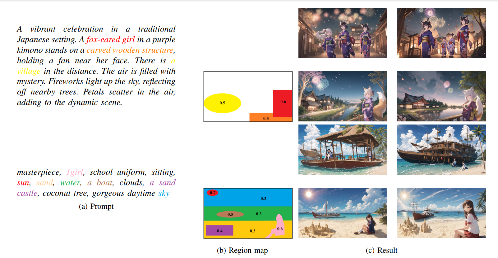
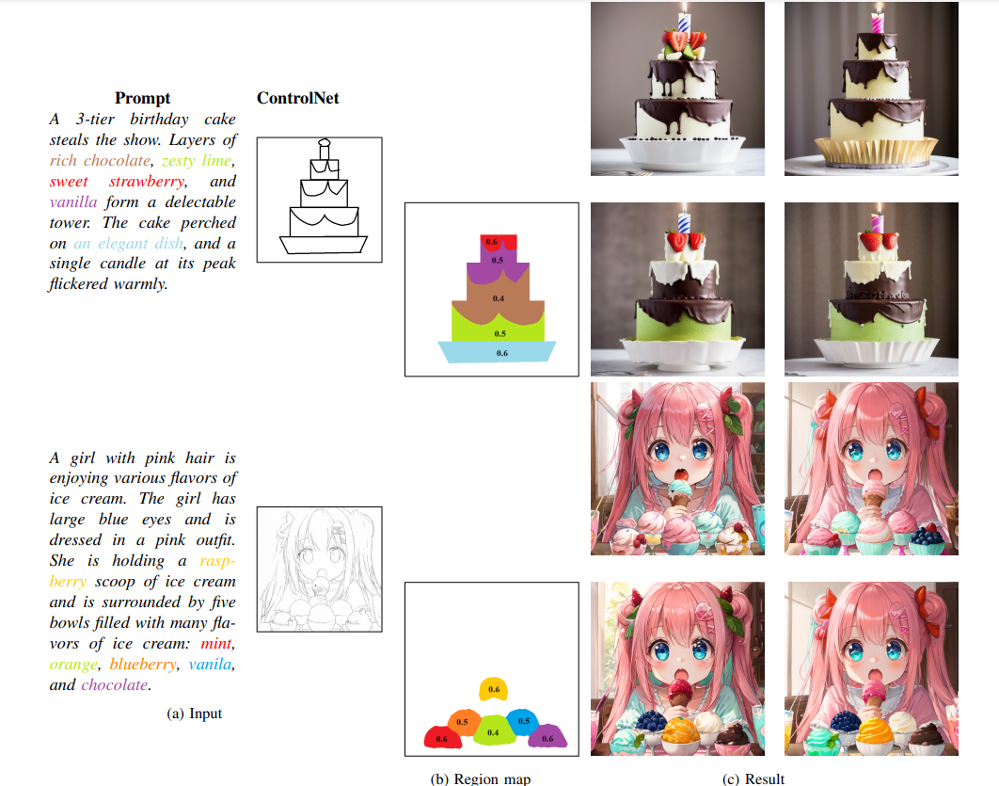
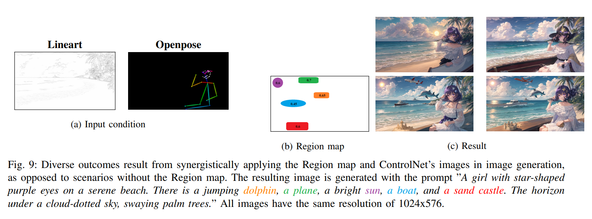
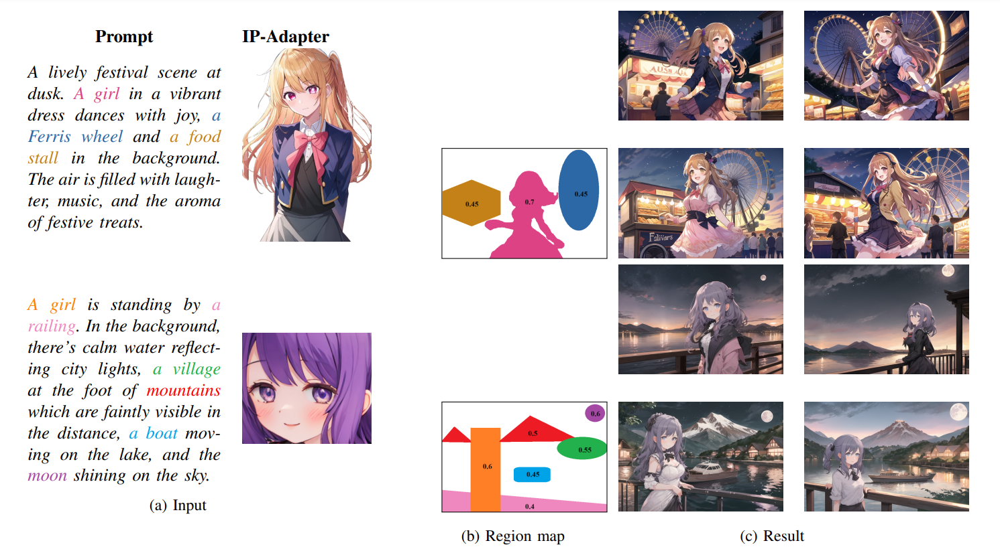
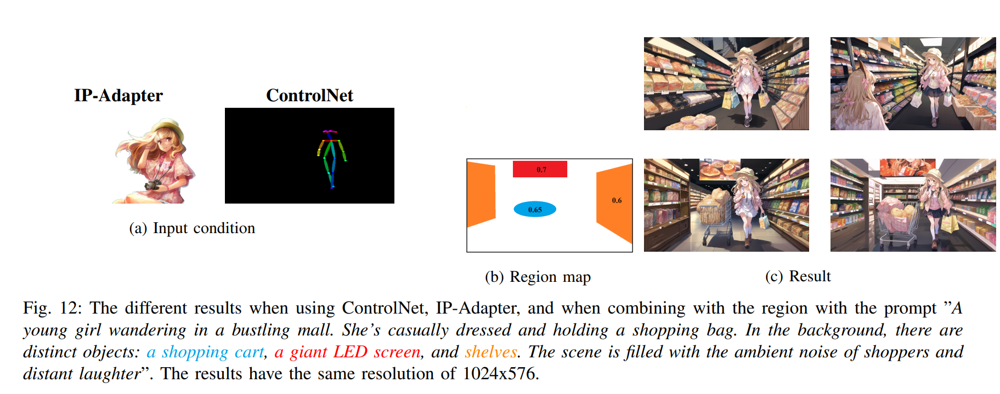

# Implemented Spatial Control with Stable Diffusion

Recent advancements in diffusion models have demonstrated remarkable outcomes in text-to-image synthesis. However, relying solely on text prompt can introduce spatial ambiguity and limit user controllability. In this project, we introduce a free-training method to enhance spatial object placement in diffusion models without the need for additional training data or complex architectures. This method leverages the inherent cross-attention mechanism within diffusion models.


## Table of Contents

- [Overview](#overview)
- [Features](#features)
- [Method](#method)
- [Result](#result)
- [Conclusion](#conclusion)
- [Installation](#installation)
- [Usage](#usage)
- [Contributing](#contributing)
- [License](#license)

## Overview
Our method allows users to achieve precise control over spatial object placement by fine-tuning the cross-attention map. This map establishes connections between specific regions and corresponding object descriptors in the text prompt. Users can define which regions contain desired objects, leading to enhanced user controllability without significantly increasing computational costs. The result is a method that balances prompt and conditional information, producing high-aesthetic image generation.

Developing and implementing method with [the Hugging Face Diffusers library](https://github.com/huggingface/diffusers). All the result images were generated from models with architectures similar to [Stable Diffusion v1.5](https://huggingface.co/runwayml/stable-diffusion-v1-5).


## Features
- **Spatial Control**: Fine-tune cross-attention maps to control the placement of objects in generated images.
- **Free-training Method**: Achieve spatial control without requiring additional training data or complex model architectures.
- **High-Aesthetic Image Generation:** Maintain a balance between prompt and conditional information for high-quality image generation.

## Method
### User-input

The user provides a text prompt $p$, and a region map $R$. Additionally, the user specifies correspondences $O$ between words in a text prompt, region masks in $R$, and strength relationships $S$. We define ~$O = {\(O_i\)_{i=1}^{N}}$~, with ~$O_i$~ being the word the user wants to control, and ~$N$~ is the number of objects. The region map ~$R$~ is defined as ~$R = \{R_{O_i}\}$~, with ~$R_{O_i}$~ corresponding to the region mask associated with word $O_i$. The strength relationships are described by $S = \{S_{O_i}\}$, with $S_{O_i}$ showing the level of $O_i$ situated within region $R_{O_i}$. Moreover, there is an optional hyperparameter,  $S' = \{S'_{O_i}\}$, which is utilized to reduce the correlation between unmarked regions with $O_i$.


> The results were obtained with different $S$ and $S'$ values for the "1girl", with $S$ and $S'$ of the "sun" set to a constant value of 0.5 and 0.

The method's hyperparameter selection is crucial. In [Figure](Figure/image_readme/user_input.svg), images were generated with the same seed, using a guidance scale of 7.5, [DPM++ 2M Karras sampler](https://github.com/crowsonkb/k-diffusion) with 25 steps, all on the same device. Proper values for $S$ are vital; appropriately choosing each $S_{O_i}$ ensures images align with desired positions. Incorrect hyperparameters may lead to unexpected results. Careful selection not only aids in generating images with specified words but also enhances aesthetic quality. $S'$ supports the cross-attention map's focus on the desired word in the region. In [Figure](Figure/image_readme/user_input.svg), adjusting $S'$ affected only $S = 0.4$ for misplaced instances, while for others, it altered picture features. Modifying $S'$ can enhance overall image composition for more aesthetically pleasing results.

### Workflow


> Visualizing the method's process. Users manipulate object placement by choosing phrases like 'A girl' and 'bridge'. User-designated masks enhance the importance of these phrases in the attention matrix within cross-attention layers.

The cross-attention maps of a Stable Diffusion by using [DAAM](https://github.com/castorini/daam/) with the prompt "**A girl** sitting on the **bridge**." and chosing 2 pharses "A girl" and "bridge"


> Visualizing cross-attention maps for Stable Diffusion with [DAAM](https://github.com/castorini/daam/). The top row depicts the scenario without our method, while the bottom row demonstrates its impact. Highlighted pixels in heatmaps show stronger relationships with each word, showcasing the network's focus on distinct pixels for individual words.

Through experimentation, we observed that using a scale $\beta$ at high noise levels and making the influence of A irrelevant to the scale of Q and K results in a more pronounced emphasis on the object’s region.

<!-- #region -->
<p align="center">
$\beta = \sigma.std(a),$
</p>
<!-- #endregion -->


where:
   - $\sigma$ is the current noise level;

   - $a$ is the outcome of the computational process involving Q, K, and the attention mask, as expressed by the formula $a$ = $Q\cdot K^{T} + M$.

## Experiments
For each prompt, the results utilized the same configurations and a region map. The region map is a map that illustrates the areas of instances, and on these region maps, we also attached the hyperparameters used to generate that image. Furthermore, for each prompt, we generated images without using the region map and with multiple seed usage. Our method, when using Stable Diffusion took 5 seconds to generate an image, whereas without it, the process took 4.6 seconds on a computer with 1 NVIDIA T4 GPU.


### Quantitative Evaluation
- To ensure fairness, we ran them on identical hardware using the "QuinceMix v2.0" model, which is structurally similar to Stable Diffusion v1.5 with specific hyperparameters: negative prompt ("bad quality, low quality, jpeg artifact, cropped"), clip skip = 2, guidance scale = 7.5, and the consistent generated image size of 512x512. All methods used the same seeds and the [DPM++ 2M Karras sampler](https://github.com/crowsonkb/k-diffusion) with 25 sampling steps for the reverse diffusion process.

- To ensure optimal performance, we adopted the hyperparameters from the respective papers for [MultiDiffusion](https://github.com/omerbt/MultiDiffusion) and [Masked-Attention Guidance](https://github.com/endo-yuki-t/MAG) methods. For MultiDiffusion, we used bootstrapping with a 20% value for denoising steps. Masked-Attention Guidance's guidance scale ($\alpha$) and loss weight ($\lambda$) were set to 0.08 and 0.5, respectively. We customized $S$ and didn't use $S'$ in our method , as indicated in the region maps. Our evaluation process involved randomly selecting seeds for each prompt and region map, and the methods generated images across all these selected seeds. The assessment results adhered to three criteria:
	- **Region Map Compliance:** Evaluates the faithfulness of generated objects to the predefined region. Higher scores indicate better alignment with the specified region, a crucial criterion.
	- **Prompt Compliance:** Evaluates how well the generated image includes all objects from the prompt, with a higher score indicating better adherence to the prompt.
	- **Secondary Criterion:** Awards additional points for aesthetically pleasing and high-quality generated images, serving as a supplementary evaluation criterion.
- By considering these three criteria, our evaluation aims to provide a comprehensive and nuanced perspective on the performance of the methods under various conditions.


> Illustrate the generated images for each method with each pair of prompt and a region map, where the methods' results on the left represent the least satisfying criteria and on the right represent the most satisfying criteria.

- Relying solely on these two cases for conclusions may be misleading; thus, we provide the generated images at [here](Figure/source/quantitative_evaluation/) for a comprehensive individual evaluation.

### Expanding Evaluation

> The different diffusion models' generated images from each prompt using the same configurations and seed with our proposed method. All generated images have the same resolution of 512x512.


> The proposed method enhances Stable Diffusion's ability to prevent prompt manipulation in image generation. Columns show results with the same seed, and rows depict results with and without a Region map, all at a consistent size of 1920x1088.

### Integration with Controllable Tools

#### ControlNet

> With a general description prompt, by combining ControlNet and our methodology, images tailored to the users' needs can be created. Columns show results with the same seed, while rows illustrate results with and without a Region map.


> Notice without method a lot of intances are missing.

#### IP-Adapter

> Visualization of images generated with IP-Adapter, combining region maps and prompts. Each column shows results with the same seed and the same input in each row. The first row shows results without a region map, and the second row uses a region map. All results have the same resolution of 768x512.

#### Comparing with IP-Adapter attention masking


> All generated images are used in the same configuration, except for the IPAdapter scale, a unique seed, and the same dimensions of 768x512. The object's region image describes the character's position in the picture. It can be observed that our method performs better than IPAdapter attention masking. "Regular" means that the images are generated in a normal way without applying masks to the objects.

#### IP-Adapter + ControlNet


## Conclusion

- From the images generated with corresponding region maps, this method performs quite well across various cases and sizes of test images. However, due to its reliance on cross-attention refinement to highlight specific regions, there may be instances where it does not work optimally. For example, if the region of interest is relatively small or exhibits unusual characteristics, the model may fail to generate an appropriate image. 
- Furthermore, if the positions of the objects are chosen by the user and the model has not been trained on those positions, it will not generate the desired images. In addition, to obtain the desired images, users need to set the input hyperparameters appropriately. If the  hyperparameters are set too high, the generated images will be very poor, while if the hyperparameters are set too low, they will not meet the user's expectations.


## Installation
To use our project, follow these installation steps:
```bash
git clone https://github.com/duongve13112002/DiffusionSpatialControl.git
cd DiffusionSpatialControl/source
pip install -r requirements.txt
```
## Usage
For the convenience of using this method, we have implemented it on a simple web application using [the Gradio library](https://github.com/gradio-app/gradio).
```bash
cd DiffusionSpatialControl/source
python app.py
```

## Contributing

We welcome contributions! Follow these steps to contribute to our project:

1. Fork the repository
2. Create a new branch: `git checkout -b feature/your-feature`
3. Make your changes and commit them: `git commit -m 'Add new feature'`
4. Push to the branch: `git push origin feature/your-feature`
5. Submit a pull request

## License

This project is licensed under the Apache-2.0 License - see the [LICENSE](LICENSE) file for details.

