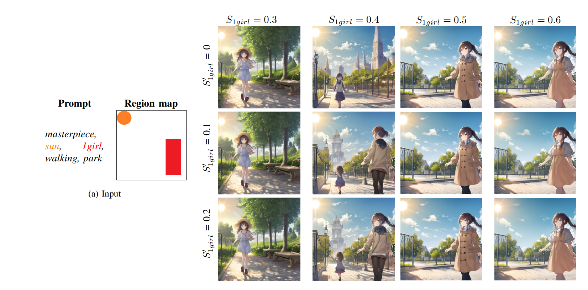
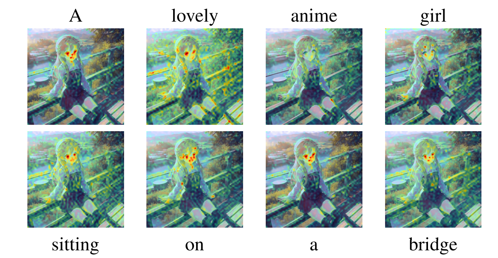
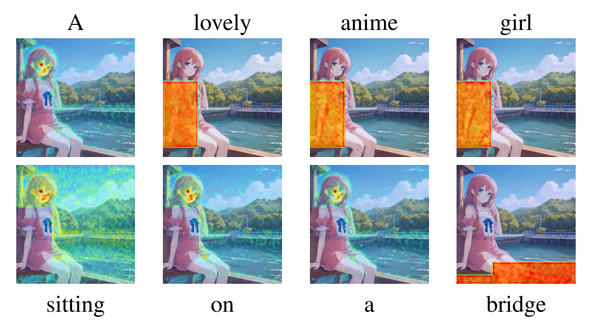
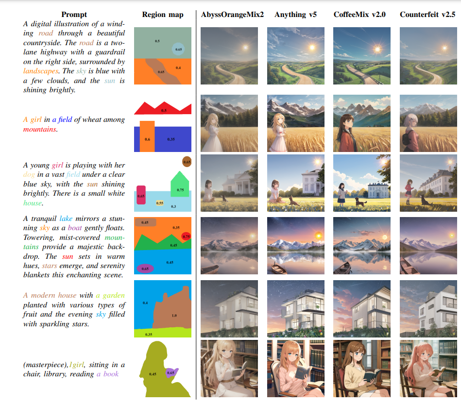
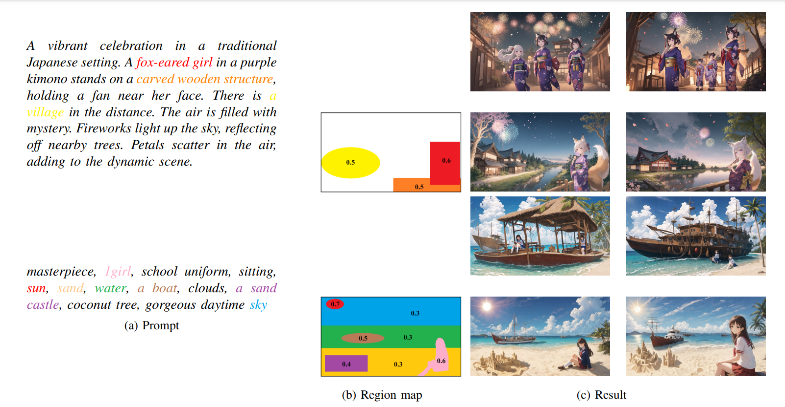
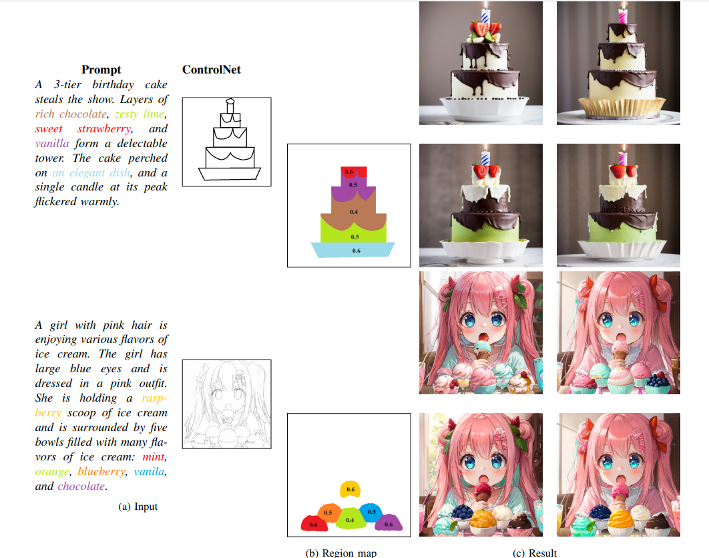
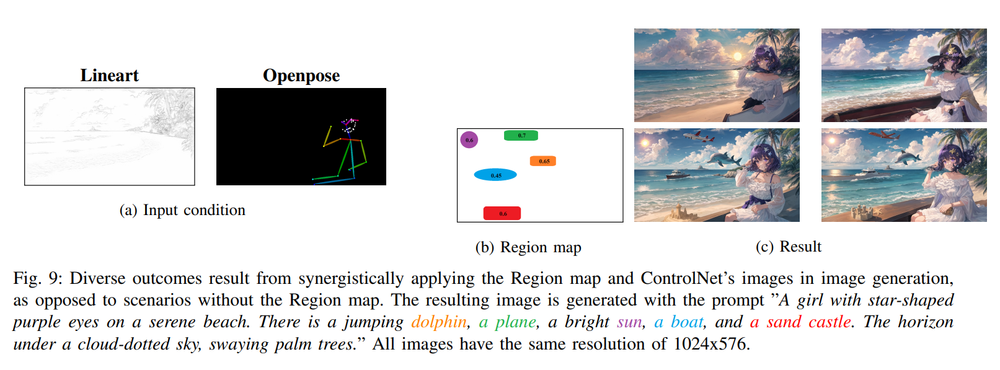
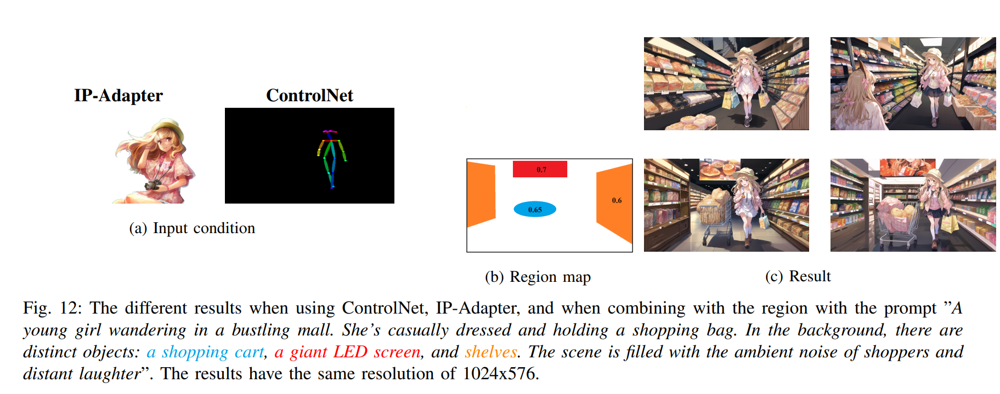

# Implemented Spatial Control with Stable Diffusion

Recent advancements in diffusion models have demonstrated remarkable outcomes in text-to-image synthesis. However, relying solely on text prompt can introduce spatial ambiguity and limit user controllability. In this project, we introduce a free-training method to enhance spatial object placement in diffusion models without the need for additional training data or complex architectures. This method leverages the inherent cross-attention mechanism within diffusion models.


## Table of Contents

- [Overview](#overview)
- [Features](#features)
- [Method](#method)
- [Result](#result)
- [Conclusion](#conclusion)
- [Installation](#installation)
- [Usage](#usage)
- [Contributing](#contributing)
- [License](#license)

## Overview
Our method allows users to achieve precise control over spatial object placement by fine-tuning the cross-attention map. This map establishes connections between specific regions and corresponding object descriptors in the text prompt. Users can define which regions contain desired objects, leading to enhanced user controllability without significantly increasing computational costs. The result is a method that balances prompt and conditional information, producing high-aesthetic image generation.

Developing and implementing method with [the Hugging Face Diffusers library](https://github.com/huggingface/diffusers). All the result images were generated from models with architectures similar to [Stable Diffusion v1.5](https://huggingface.co/runwayml/stable-diffusion-v1-5).


## Features
- **Spatial Control**: Fine-tune cross-attention maps to control the placement of objects in generated images.
- **Free-training Method**: Achieve spatial control without requiring additional training data or complex model architectures.
- **High-Aesthetic Image Generation:** Maintain a balance between prompt and conditional information for high-quality image generation.

## Method
### User-input

The user provides a text prompt $p$, and a region map $R$. Additionally, the user specifies correspondences $O$ between words in a text prompt, region masks in $R$, and strength relationships $S$. We define ~$O = {\(O_i\)_{i=1}^{N}}$~, with ~$O_i$~ being the word the user wants to control, and ~$N$~ is the number of objects. The region map ~$R$~ is defined as ~$R = \{R_{O_i}\}$~, with ~$R_{O_i}$~ corresponding to the region mask associated with word $O_i$. The strength relationships are described by $S = \{S_{O_i}\}$, with $S_{O_i}$ showing the level of $O_i$ situated within region $R_{O_i}$. Moreover, there is an optional hyperparameter,  $S' = \{S'_{O_i}\}$, which is utilized to reduce the correlation between unmarked regions with $O_i$.


> The results were obtained with different strength level $S$ and $S'$ values for the "1girl," with the strength level $S$ and $S'$ of the "sun" set to a constant value of 0.5 and 0.

The selection of hyperparameters in this method is crucial. As seen from [Figure](Figure/User_input_hyper.png), all images were generated using the same configuration and on a device. Choosing suitable values for $S$ is essential; when each $S_{O_i}$ in $S$ is chosen appropriately, the generated images will meet the desired positions. However, if these hyperparameters do not meet the criteria, the resulting images may not align with your expectations. Furthermore, the careful selection of hyperparameters not only aids in generating images with specified words but also contributes to the aesthetic quality of the images. $S'$ plays a supportive role in enhancing the attention of the cross-attention map to the desired word in the specified region

### Workflow


> Illustration of the method's process. The user has the ability to manipulate the placement of objects by choosing specific phrases, such as "lovely anime girl" and "bridge," and applying them to the canvas. The designated masks provided by the user contribute to elevating the significance of the respective phrases in the attention matrix within the cross-attention layers.

The cross-attention maps of a Stable Diffusion by using [DAAM](https://github.com/castorini/daam/) with the prompt "A **lovely anime girl** sitting on a **bridge**." and chosing 2 pharses "lovely anime girl" and "bridge"
> Without using method

> Using method

> The highlighted pixels in heatmaps show stronger associations with each word, showcasing the network’s focus on distinct pixels for individual words.

Through experimentation, we observed that using a scale $\beta$ at high noise levels and making the influence of A irrelevant to the scale of Q and K results in a more pronounced emphasis on the object’s region.

<!-- #region -->
<p align="center">
$\beta = \sigma.std(a),$
</p>
<!-- #endregion -->


where:
   - $\sigma$ is the current noise level;

   - $a$ is the outcome of the computational process involving Q, K, and the attention mask, as expressed by the formula $a$ = $Q\cdot K^{T} + M$.

## Result
For each prompt, the results utilized the same configurations and a region map. The region map is a map that illustrates the areas of instances, and on these region maps, we also attached the hyperparameters used to generate that image. Furthermore, for each prompt, we generated images without using the region map and with multiple seed usage. Our method, when using Stable Diffusion took 5 seconds to generate an image, whereas without it, the process took 4.6 seconds on a computer with 1 NVIDIA T4 GPU.


> The different diffusion models' generated images from each prompt using the same configurations and seed with our method.


> The effectiveness of image generation using the proposed method contributes to Stable Diffusion's ability to avoid prompt manipulation. All generated images are executed at a consistent size of 1920x1088.

### Integration with Control Methods

#### ControlNet

> With a general description prompt, by combining ControlNet and our methodology, images tailored to the users' needs can be created.


> Notice without method a lot of intances are missing.

#### IP-Adapter

> In this figure, for each distinct prompt, we present four results. Results within the same column represent images generated with the same random seed, and within the same row, the same input is utilized. The first row showcases outcomes without utilizing a region map, while the second row employs a region map. The results have the same resolution of 768x512.

#### IP-Adapter + ControlNet


## Conclusion

- From the images generated with corresponding region maps, this method performs quite well across various cases and sizes of test images. However, due to its reliance on cross-attention refinement to highlight specific regions, there may be instances where it does not work optimally. For example, if the region of interest is relatively small or exhibits unusual characteristics, the model may fail to generate an appropriate image. 
- Furthermore, if the positions of the objects are chosen by the user and the model has not been trained on those positions, it will not generate the desired images. In addition, to obtain the desired images, users need to set the input hyperparameters appropriately. If the  hyperparameters are set too high, the generated images will be very poor, while if the hyperparameters are set too low, they will not meet the user's expectations.


## Installation
To use our project, follow these installation steps:
```bash
git clone https://github.com/duongve13112002/DiffusionSpatialControl.git
cd DiffusionSpatialControl/source
pip install -r requirements.txt
```
## Usage
For the convenience of using this method, we have implemented it on a simple web application using [the Gradio library](https://github.com/gradio-app/gradio).
```bash
cd DiffusionSpatialControl/source
python app.py
```

## Contributing

We welcome contributions! Follow these steps to contribute to our project:

1. Fork the repository
2. Create a new branch: `git checkout -b feature/your-feature`
3. Make your changes and commit them: `git commit -m 'Add new feature'`
4. Push to the branch: `git push origin feature/your-feature`
5. Submit a pull request

## License

This project is licensed under the Apache-2.0 License - see the [LICENSE](LICENSE) file for details.

